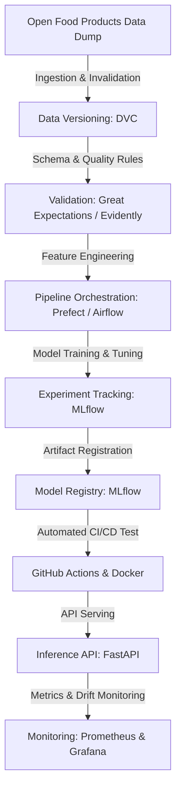

<h1 align="center">🥗 open_food_mlops</h1>

<p align="center">
  <strong>An End-to-End MLOps Pipeline for Continuous Open Food Products Analytics & Classical Machine Learning</strong>
</p>

<p align="center">
  
  
  
  
</p>

<p align="center">
  <a href="#-project-motivation--rationale">Motivation</a> •
  <a href="#-mlops-architecture--stack">Architecture & Stack</a> •
  <a href="#-repository-structure">Repository Structure</a> •
  <a href="#-project-roadmap">Roadmap</a> •
  <a href="#-getting-started">Getting Started</a>
</p>

---

## 🎯 Project Motivation & Rationale

`open_food_mlops` is a production-grade MLOps framework designed to continuously process, validate, model, and monitor the massive **Open Food Products** dataset. 

### Why Open Food Products Data?
* **Massive Scale & High Volume:** Contains over a million products globally with complex tabular schemas, missing values, and high dimensionality.
* **Frequently Updated Stream:** Data is constantly updated by a global contributor base, presenting real-world data drift and schema evolution challenges.
* **Classical ML Friendly:** Perfectly suited for classical tree-based models (XGBoost, LightGBM, CatBoost) and statistical preprocessing pipelines.

### Primary ML Objective
The core objective is to automate quality scoring (e.g., predicting Nutri-Score/Eco-Score grades, ingredient category classification, or automated anomaly detection in nutritional reporting) through automated retraining, validation, and serving pipelines.

---

## 🏗️ MLOps Architecture & Stack

This project implements a complete, production-grade MLOps stack tailored specifically for classical tabular machine learning systems.



### Tooling Breakdown

| MLOps Layer | Selected Technology | Purpose & Usage |
| --- | --- | --- |
| **Language & Core Engine** | `Python 3.10+` `Scikit-Learn` `XGBoost` | Core data handling, feature engineering, and model estimation. |
| **Data Versioning** | `DVC (Data Version Control)` | Versioning large dataset snapshots and tracking data lineage. |
| **Pipeline Orchestration** | `Prefect` / `Airflow` | Automating continuous data ingestion, preprocessing, and training DAGs. |
| **Experimentation & Registry** | `MLflow` | Tracking parameters, metrics, artifacts, and staging model versions. |
| **Data Quality & Validation** | `Great Expectations` / `Evidently` | Catching data drift, missing value spikes, and schema violations. |
| **Packaging & Containerization** | `Docker` | Enforcing environment consistency across training and deployment. |
| **Inference & Serving** | `FastAPI` | Exposing low-latency REST endpoints for real-time model inference. |
| **CI/CD & Automation** | `GitHub Actions` | Automated testing, linting, docker builds, and pipeline verification. |
| **Monitoring & Drift** | `Prometheus` + `Grafana` | Monitoring inference request latencies, prediction distributions, and drift. |

---

## 📂 Repository Structure

```text
open_food_mlops/
├── .github/
│   └── workflows/
│       ├── ci.yml                 # Code quality, unit testing & artifact checks
│       └── cd.yml                 # Deployment execution to VPS
├── docker/
│   ├──Dockerfile.api             # Container definition for FastAPI serving
│   ├── Dockerfile.mlflow          # Container definition for MLflow server
│   ├── Dockerfile.pipeline        # Container definition for Prefect tasks/flows
│   └── nginx.conf                 # NGINX reverse proxy configuration
├── docker-compose.yml             # Local & VPS orchestration manifest
├── dvc.yaml                       # Data pipeline stage definitions
├── dvc.lock                       # DVC state tracking file
├── pyproject.toml                 # Dependencies (uv managed)
├── README.md
├── config/
│   ├── config.yaml                # Main operational parameters
│   └── logging.yaml               # Structured logging definitions
├── data/                          # DVC tracked directory
│   ├── raw/
│   ├── processed/
│   └── predictions/
├── models/                        # Local registry artifacts cache
├── notebooks/
│   └── 01_exploratory_poc.ipynb
├── pipelines/                     # Prefect Workflows
│   ├── data_ingestion_flow.py
│   ├── training_flow.py
│   └── batch_inference_flow.py
├── src/
│   └── open_food_mlops/
│       ├── __init__.py
│       ├── config/
│       │   ├── schema.py          # Pydantic data validation schemas
│       │   └── settings.py        # Environment variables & paths
│       ├── domain/                # Business & Core ML Logic
│       │   ├── preprocessor.py    # Text & tabular feature transformation
│       │   ├── trainer.py         # Model training & hyperparameter tuning
│       │   └── evaluator.py       # Metrics calculation (F1, Accuracy per class)
│       ├── infrastructure/        # External Adaptors & Integrations
│       │   ├── data_loader.py     # Data retrieval (Open Food Facts API/Dumps)
│       │   ├── mlflow_client.py   # Logging metrics, parameters, and models
│       │   └── storage.py         # Local IO and artifact management
│       └── utils/
│           ├── logger.py          # Centralized logger factory
│           └── metrics.py
├── serving/                       # Real-Time Inference Application
│   ├── app.py                     # FastAPI entrypoint
│   └── schemas.py                 # Request/Response DTOs
└── tests/
    ├── unit/                      # Fast domain component test suite
    ├── integration/               # Pipeline and storage tests
    └── end_to_end/                # API contract tests
```

---

## 🚦 Project Roadmap & Development Phase

This project is under **active, incremental development**. Progress is tracked across the following milestones:

* [x] **Phase 1: Project Setup & Framing**
* [x] Define domain problem and MLOps tooling architecture.
* [x] Establish repository design pattern and virtual environments.


* [ ] **Phase 2: Data Pipeline & Ingestion**
* [ ] Configure DVC tracking for Open Food Products datasets.
* [ ] Implement data ingestion scripts and initial Exploratory Data Analysis (EDA).
* [ ] Set up baseline schema validation checks using Great Expectations.


* [ ] **Phase 3: Model Engineering & Experimentation**
* [ ] Build baseline Scikit-Learn / XGBoost tabular pipelines.
* [ ] Integrate MLflow for hyperparameter logging and artifact tracking.


* [ ] **Phase 4: Orchestration & Automation**
* [ ] Construct automated DAGs using Prefect / Airflow.
* [ ] Implement GitHub Actions for automated unit testing (`pytest`) and linting.


* [ ] **Phase 5: Serving & Monitoring**
* [ ] Build containerized FastAPI endpoint.
* [ ] Implement data drift monitoring triggers via Evidently AI.


---

## ⚡ Getting Started

### Prerequisites

* Python 3.10+
* Git & DVC
* Docker (optional, for containerized execution)

### 1. Clone & Set Up Environment

```bash
# Clone the repository
git clone https://github.com/Ibraheem-Al-hafith/open_food_mlops.git
cd open_food_mlops

# Create virtual environment
source .venv/bin/activate  # On Windows: .venv\Scripts\activate

# Install dependencies
uv sync

```

### 2. Initialize Data Version Control (DVC)

```bash
# Pull versioned data artifacts (if configured)
dvc pull

```

---

## 📜 License

Distributed under the MIT License. See `LICENSE` for more information.
